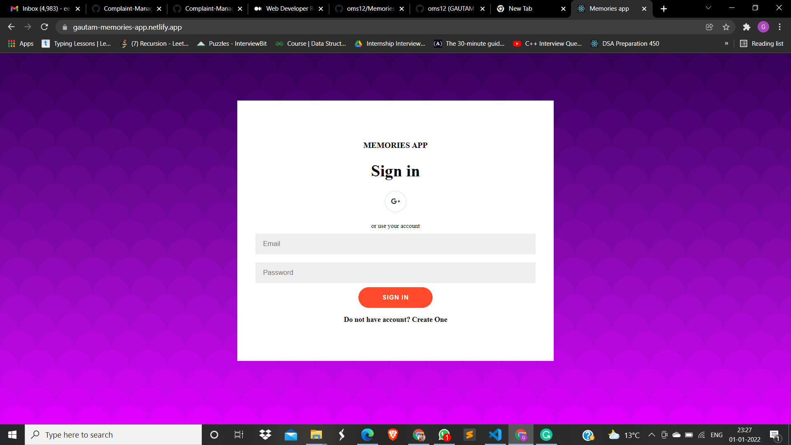
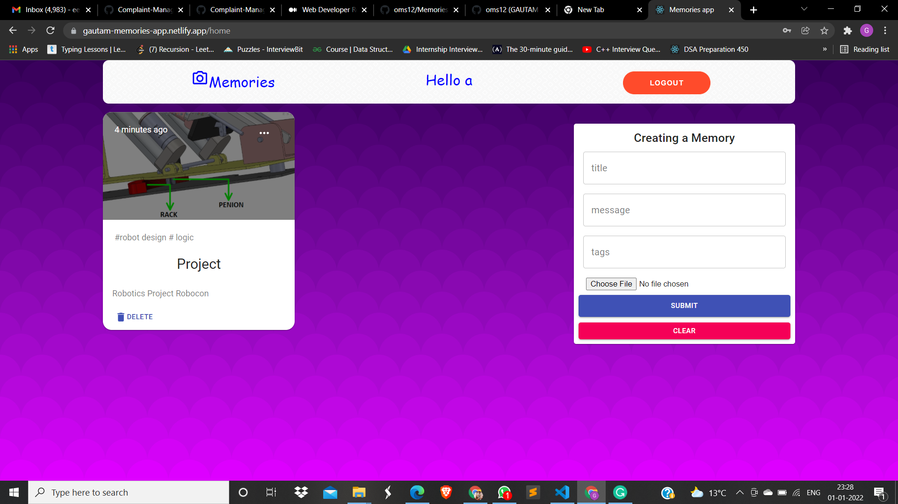

# Memories-App
It is the platform where User can Store his/her memories with Image, Title, Tags alongwith message. Moreover he can update and delete his memories posts.
I have hosted my website on [Frontend Netlify and Backend Heroku ](https://gautam-memories-app.netlify.app/)
  
## Tech Stuff Used
HTML5, CSS3, React js   
NodeJs    
MongoDB 
Auhthentication using jwt tokens.  
## Run This Webapp On Your Local Device
Install NodeJS    
Clone the repository  
Make account on MongoDB Atlas and make a collection and the link to CONNECTION_URL in index.js of the server. 
   
In CMD, navigate to Keeper-app folder and run   
`$ npm install`   

Then in CMD, run this code  
`$ npm start ` on both server side as well as client side by opening two terminals.
   
In your browser, navigate to this [URL](http://localhost:3000)  
Login Page would be visible  
Now you can register and Login and ready to use the web app. 
   
## Website Screeenshots    
   
      
    
   
   
#### If you find any errors, feel free to raise an issue :) 
